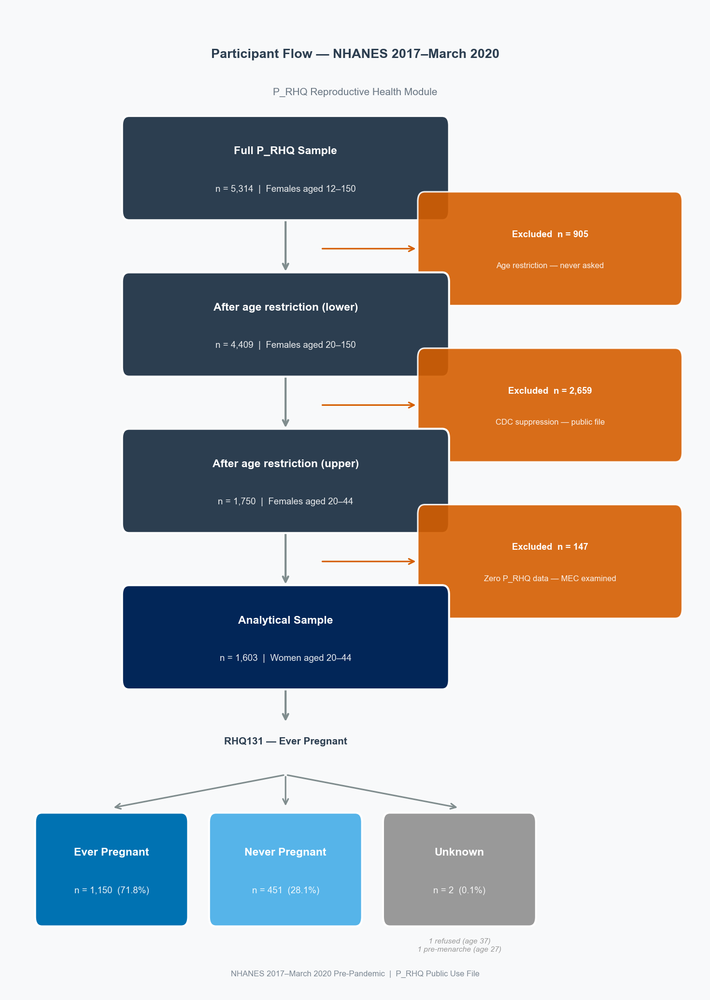

# nhanes-ckm
## Reproductive History and Cardiometabolic Risk Phenotyping in Women
### NHANES 2017–March 2020 Pre-Pandemic Data
## Author
**Alexandra Velez, MD** — OB-GYN (Colombia). Data Analyst
GitHub: [@alexavelez](https://github.com/alexavelez)


---

## Clinical Motivation

Standard cardiovascular risk calculators — the Pooled Cohort Equations, 
SCORE2, and most clinical decision tools — were developed predominantly in 
male cohorts and miss female-specific risk signals entirely. A woman's 
reproductive history contains information about her long-term cardiometabolic 
trajectory that no standard risk calculator captures.

The 2023 AHA/ACC Cardiovascular-Kidney-Metabolic (CKM) framework explicitly 
recognizes adverse pregnancy outcomes as cardiovascular risk enhancers — yet 
they remain absent from routine clinical risk assessment. A 35-year-old woman 
with a history of gestational diabetes and borderline metabolic biomarkers has 
a fundamentally different risk trajectory than a 35-year-old without that 
history, even when their current lab values look identical. Gestational 
diabetes reveals underlying insulin resistance years — sometimes decades — 
before conventional screening would detect it.

- **Gestational diabetes** → 7x increased lifetime risk of type 2 diabetes
- **Preeclampsia** → 2–4x increased risk of cardiovascular disease
- **Current risk calculators** → ignore these factors entirely

This project tests whether women with adverse pregnancy outcomes cluster into 
distinct cardiometabolic phenotypes using NHANES 2017–March 2020 reproductive 
health and metabolic data. The pipeline links reproductive history (P_RHQ) to 
metabolic biomarkers (P_BIOPRO, P_GHB), anthropometrics (P_BMX), and blood 
pressure (P_BPXO) to identify CKM risk phenotypes that standard screening 
would miss.

---

## Clinical Vignette

> A 35-year-old woman presents for a routine checkup. BMI 28, BP 125/80,
> HbA1c 5.6%. By every standard risk calculator she is low risk — no 
> intervention indicated.
>
> Her reproductive history: two pregnancies, both complicated by gestational 
> diabetes. Standard risk tools ignore this entirely.
>
> This project asks: does her reproductive history place her in a 
> cardiometabolic phenotype that warrants earlier intervention? And can 
> we identify that phenotype systematically across a nationally 
> representative sample?

---

## Analytical Sample

| Parameter | Value |
|---|---|
| Source | NHANES 2017–March 2020 Pre-Pandemic |
| Modules | P_RHQ, P_DEMO, P_BIOPRO, P_GHB, P_BMX, P_BPXO |
| Full P_RHQ sample | 5,314 females aged 12–150 |
| Excluded — age < 20 | 905 (age restriction) |
| Excluded — age > 44 | 2,659 (CDC data suppression) |
| Excluded — non-response | 147 (zero P_RHQ data) |
| **Analytical sample** | **1,603 women aged 20–44** |
| Survey weight | WTMECPRP (MEC examination weight) |

The restriction to women aged 20–44 is driven by CDC data suppression — 
pregnancy and hysterectomy data for women outside this range has been removed 
from the public use file due to disclosure risk. The complete dataset is 
available through the [NCHS Research Data Center](https://www.cdc.gov/rdc/).

---

## Notebook Pipeline

| Notebook | Status | Description |
|---|---|---|
| `01_data_exploration.ipynb` | Complete | Data loading, SAS artifact detection, NHANES encoding, skip logic mapping, analytical sample definition, weighted prevalence estimates |
| `02_reproductive_feature_engineering.ipynb` | In progress | Feature engineering across four reproductive domains: pregnancy history, adverse pregnancy outcomes, surgical history, hormone therapy |
| `03_ckm_integration.ipynb` | Planned | Linking reproductive features to metabolic biomarkers via SEQN |
| `04_exploratory_analysis.ipynb` | Planned | Descriptive analysis of reproductive-CKM feature relationships |
| `05_clustering.ipynb` | Planned | Unsupervised phenotyping — identifying CKM risk clusters |
| `06_clinical_interpretation.ipynb` | Planned | Clinical interpretation of clusters and actionable risk communication |

---

## Key Findings — Notebook 01

**SAS XPT artifact detected and fixed.** True zero values in seven variables 
across both source files were stored as 5.397605e-79 due to a known SAS 
floating point export issue. Affected variables include WTMECPRP (survey 
weight, n=1,260), RHD167 (parity, n=173), and RIDAGEYR (age, n=574). A 
reusable detection function (`scan_sas_artifacts()`) is defined in Section 4 
and should be applied to any SAS XPT file before analysis.

**Missingness is structural, not random.** Every missing value in RHQ131 
(ever pregnant — the most critical gate variable) was traced to a known 
cause: 905 age-restricted teenagers, 204 CDC-suppressed adults 45+, 148 
confirmed module non-responders, and 5 refused/don't know. None are 
recoverable through imputation.

**Demographic composition confirmed.** The 5.8 percentage point difference 
between unweighted (71.8%) and weighted (66.0%) ever-pregnant prevalence was 
fully explained by racial/ethnic and income oversampling, consistent with 
NHANES analytic notes (Stierman et al., 2021).

**GDM prevalence: 10.9% (weighted)** among women aged 20–44 — consistent 
with published CDC surveillance data, providing an independent validation 
that the survey weight application is producing correct results.

---

## Participant Flow



---

## Data Access

NHANES data is publicly available at no cost from the CDC. Download all 
required modules with the included script:
```bash
python scripts/download_nhanes_data.py
```

Or download manually:

| File | Description | Link |
|---|---|---|
| P_RHQ.XPT | Reproductive Health Questionnaire | [CDC](https://wwwn.cdc.gov/Nchs/Data/Nhanes/Public/2017/DataFiles/P_RHQ.xpt) |
| P_DEMO.XPT | Demographics & Survey Weights | [CDC](https://wwwn.cdc.gov/Nchs/Data/Nhanes/Public/2017/DataFiles/P_DEMO.xpt) |
| P_BMX.XPT | Body Measures | [CDC](https://wwwn.cdc.gov/Nchs/Data/Nhanes/Public/2017/DataFiles/P_BMX.xpt) |
| P_BPXO.XPT | Blood Pressure | [CDC](https://wwwn.cdc.gov/Nchs/Data/Nhanes/Public/2017/DataFiles/P_BPXO.xpt) |
| P_GHB.XPT | Glycohemoglobin | [CDC](https://wwwn.cdc.gov/Nchs/Data/Nhanes/Public/2017/DataFiles/P_GHB.xpt) |
| P_BIOPRO.XPT | Biochemistry Profile | [CDC](https://wwwn.cdc.gov/Nchs/Data/Nhanes/Public/2017/DataFiles/P_BIOPRO.xpt) |

Place all files in `data/raw/` before running the notebooks.

---

## Reproduction
```bash
# Clone the repository
git clone https://github.com/alexavelez/nhanes-ckm.git
cd nhanes-ckm

# Create environment
conda env create -f environment.yml
conda activate nhanes-ckm

# Download NHANES data
python scripts/download_nhanes_data.py

# Run notebooks in order
jupyter notebook
```

---

## Technical Stack

| Tool | Purpose |
|---|---|
| Python 3.11 | Core language |
| pandas | Data manipulation |
| numpy | Numerical operations |
| matplotlib | Visualization |
| seaborn | Statistical graphics |

**Planned additions:**

| Tool | Purpose |
|---|---|
| rpy2 + R survey | Complex survey design — SE and CI estimation |
| scikit-learn | Clustering (notebook 05) |
| scipy | Statistical testing |

---

## Project Status

Notebook 01 is complete. Notebook 02 is in progress. The weighted 
prevalence implementation will be upgraded from `numpy.average()` to a 
full complex survey design using the R `survey` package via rpy2 — adding 
standard errors and 95% confidence intervals to all prevalence estimates. 
Implementation is planned after the full pipeline is complete.

---

## Planned Work

- Complete notebooks 02–06
- Upgrade weighted prevalence to R `survey` package via rpy2
- Validate phenotypes against published NHANES estimates
- Link clusters to NHANES mortality follow-up data for outcome validation
- Extend analysis to NHANES 2021–2023 cycle for trend comparison

---

## Reference

Stierman B, Afful J, Carroll MD, et al. National Health and Nutrition 
Examination Survey 2017–March 2020 prepandemic data files — development 
of files and prevalence estimates for selected health outcomes. *National 
Health Statistics Reports*; no. 158. Hyattsville, MD: National Center for 
Health Statistics. 2021.

---

*NHANES 2017–March 2020 Pre-Pandemic | P_RHQ Reproductive Health Module*
*Analytical sample: 1,603 women aged 20–44*